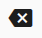

.. index:: go back one timeline
.. index:: move the timeline forward
.. index:: Shrink timeline display
.. index:: Enlarge the display of the timeline
.. index:: load the frame

##########################################
A few things about timeline display
##########################################

We will explain the timeline toolbar.

.. image::img/tl_1.png
    :align: center

|

.. image::img/tl_2.png
    :align: center

|

.. |tlprev| image:: img/tl_3.png
.. |tlnext| image:: img/tl_4.png

.. |tlseek| image:: img/tl_a.png
.. |tlvisi| image:: img/tl_b.png
.. |tlinsf| image:: img/tl_c.png

.. index:: timeline toolbar

|tlprev| **Go back one timeline**
    In the currently selected timeline, return to the closest registered keyframe before the current position. (Skip frames with nothing registered)

|tlnext| **Move forward in timeline**
    In the currently selected timeline, advance to the nearest registered keyframe after the current position. (Skip frames with nothing registered)

|tlout| **Shrink timeline view**
    Make the timeline display compact.

|tlin| **Expand timeline view**
    Resize the timeline display to normal size. This is the standard size.

.. image::img/tl_7.png
    :align: center

|

|tlplay| **play from beginning, play/pause, stop**
    It has the same function as the button on the animation tab of the ribbon bar.

|tlload| **load this frame**
    | Immediately read the contents of the keyframes of all timelines (rolls) corresponding to the currently selected frame position, and restore poses and properties. Selecting a frame position normally restores it automatically, but this button manually calls it.
    | * Mainly used when ``Preview when selecting a frame`` in the settings is off.

|tlinsf| **Insert an empty frame at the current position**
    Inserts an empty frame into all timelines at the position of the currently selected frame number. This shifts all keyframes after this frame number to the right by one.

|tldelf| **delete current frame position**
    | Deletes the currently selected frame position of all timelines. Since this involves deleting a frame position, not just deleting a keyframe, all keyframes after this frame will be shifted one by one to the left.
    | Also, please note that if there is a keyframe at the current position, it will be deleted together.

|tlseek| **Seek Bar**
    Move the frame position to any position on the timeline. The size of this seek bar does not change even if the number of frames increases or decreases.

    | * If ``Preview when selecting a frame`` in the settings is on, you can preview the animation frame by frame by moving it slowly. (some properties are not previewed)

.. warning::
    Due to the interlocking specifications of HTML and WebGL, the preview may not keep up if you move it too quickly.

|

|tlvisi| **Show/hide timeline cast (object)**
    You can hide the cast of the selected timeline. IK markers will still be visible when hidden. (If you select another cast, even the IK marker will not be displayed)