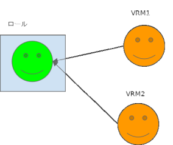

.. index:: Animation project configuration

######################################
Animation project structure
######################################

We will explain the structure of the animation project. Roughly speaking, it goes like this:

.. index:: timeline (animation project configuration)

Timeline
    .. image::img/specifi_1.png
        :align: left

    | The timeline is the basic unit of animation. One timeline corresponds to one role and one cast.
    | The following roles are responsible for all of the actual functions.

|
|
|
|
|
|

.. index:: Roles (animation project structure)

Role
    .. image::img/specifi_2.png
        :align: left

    | A role is a collection of roles and character actions that determine how each object moves on the timeline.
    | Within the role there are casts to be assigned and keyframe data.
    | A role can be replaced with another object as long as it is of the same object type.

    In effect, **Timeline = Roll**. When we say timeline in this manual, we mean role, and vice versa.

|
|
|
|

.. index:: cast object (animation project configuration)

Cast / object / avatar
    .. image:: img/specifi_3.png
        :align: left

    | A cast is an object assigned to a role. This is the substance of the actual VRoid/VRM, FBX, Light, Audio, and other objects.
    | In this application, they are simply referred to as objects or avatars.

|
|
|

.. index:: keyframes (animation project configuration)

Key frame
    .. image::img/specifi_4.png
        :align: left

    A keyframe is the actual movement data of the roll, the motion. This data is only held by the role, and in principle it does not depend on each object.

|
|
|

.. admonition:: timeline role cast relationship

    | The timeline is ultimately the same as the role. Then cast means the same as the actual object.
    | A role is tied to a cast (object) on a 1:1 basis. A roll can be without a cast, but a cast cannot move without a roll.

    It's loosely tied, not strict. Therefore, the role can later be associated with another cast (object).

    For example, it would be as follows. (colors and icons correspond to the example above)

    **Roll** ...  anime and drama characters

    **Cast** ... Voice actor, actor himself

| The actual animation data is held by the role. So it doesn't matter what the actual cast (object) is to play that motion.
| Because of the above mechanism, you can play your favorite animation with your favorite object.