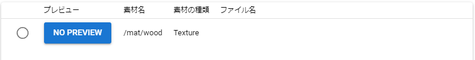

##########################################
Setting
##########################################

.. contents::

.. index:: configure the app (settings)

Set up your app
=========================================

You can fine-tune the behavior of the app from the settings screen.

1. Click the Settings button on the Home tab of the Ribbon bar.

.. image::img/config_1.png
    :align: center

|

2. The setting screen opens.

.. image::img/config_2.png
    :align: center

|

App settings
===========================

.. index:: Application Tab (Settings)

Application tab
----------------------------

This is a setting item in the application tab.

Memory usage (multiplier)
    | Adjust the amount of memory used for the WebGL screen. It can be set between 256MB and 2048MB. You cannot exceed the memory of your device.
    | By increasing this, you will be able to read huge 3D objects.

    .. warning::
        If you increase it too much, it may adversely affect the operation of the entire terminal. Please adjust accordingly.

.. image::img/config_3.png
    :align: center

|

mouse wheel speed
    Adjust the speed of zooming in and out on the WebGL screen. It can be adjusted between 1 and 5 times.

Camera movement speed during key operation
    You can adjust the camera movement speed between 0.01 and 0.25 when operating with keyboard keys on the WebGL screen.

Camera rotation speed during key operation
    You can adjust the camera rotation speed between 0.01 and 2.0 when you operate the keyboard keys on the WebGL screen.

Focus the camera's center point when an object is selected
    When a 3D object is selected, it is automatically moved to the center of the main camera within the screen. However, since it always faces the front and slightly overhead view, please turn it off if it is annoying.

Distance between camera and center point
    Normally the camera rotates around the object instead of itself. In this app, the target is not always a specific object, but a **space at a certain distance**. Specify that constant distance and the distance of the main camera.

Display the center point of the main camera
    Displays the center point of the main camera (it's the dim square display). The size of the center point changes depending on the perspective, depending on the ``distance between the camera and the center point`` above. It does not affect the objects you manipulate or the animation project in any way.

Take screenshots with HTML
    | By taking screenshots using the HTML/Javascript function, the quality will be slightly lower, but it will be stable, such as the images using multiple cameras will be reflected normally. There is no difference between the main camera and the camera object as long as you use them by switching completely. Please switch if necessary.
    | Turn this ON if you want to capture the screen as it is, including the viewport of the Camera object and the preview in the render texture.

use dark theme
    Changes the appearance of the app to a dark theme.

|

.. index:: Files Tab (Settings)

File tab
----------------------------

This is a setting item in the File tab.

Save opened files in history
    The VRMs, OtherObjects, Images, and UImages that have been opened once are saved as history in the app.

Skip VRM confirmation screen when opened from history
    For VRMs that have been opened once, we will allow them to load without displaying the confirmation screen for the terms of use. You can display it later by clicking the "Details" button.

Clear
    Deletes all history of files once opened.

Do not load files larger than this size automatically when opening a project.
    When opening an animation project, if it contains an object file that exceeds the MB size specified here, it will be skipped.
    The skipped objects must be manually read and assigned to roles.

Back up your project
    The animation project currently being created is automatically backed up. As with normal saving, the positions and rotations of IK markers that are not registered in keyframes will not be saved, so please register them in keyframes frequently.

backup interval
    Specify the backup interval. You can specify from 1 to 10 minutes.

|

.. index:: model tab (settings)

Model tab
-------------------

This is a setting item in the model tab. These are mainly settings related to the movement of the object itself.

Save thumbnails when saving poses
    When saving a pose, save a screenshot of that pose as well. There is no effect on the pose/pose file itself even if it is not saved.

Also apply global coordinates when opening poses
    | When applying the pose file to the selected VRM, also apply the global coordinates held by the pose.
    | If this is enabled, the positions will be duplicated when applying poses to multiple VRMs. Please use it by switching on / off as necessary.

Automatic ankle rotation
    | Automatically rotate the leg when moving the lower leg of IK. Since it does not fit the human body perfectly, the rotation angle may not be able to follow depending on the range in which the Lower Leg is moved.
    | Automatically turns off when playing animation.

.. |ashi_on| image:: img/config_4.png
.. |ashi_off| image:: img/config_5.png

.. csv-table:: Both are examples in which LowerLeg is only moved backward on the y-axis and z-axis

    if setting is on, if setting is off
    |ashi_on|, |ashi_off|

.. caution::
    In this way, the lower part from the ankle comes to accompany the natural rotation. However, this would involve unintentional rotation, so it would be necessary to manually unrotate the ankle after moving it.

Apply natural running controls to VRM bodies
    | Match the rotatable range of the VRM's elbow (LowerArm), foot (LowerLeg), and ankle (Leg) to the range of motion of the human body.
    | When this is turned on, the VRM will certainly have a natural range of motion, but the position and rotation of other IKs that follow the target part in an attempt to escape that restriction may result in unexpected behavior.
    | It is recommended to turn it off if necessary.
    | Automatically turns off when playing animation.

Linking bones
    In either case, it will automatically turn off when playing the animation.

    :Chest & Lower Arm & Head:
        As the ``Chest`` moves, the left and right ``LowerArms`` and ``Head`` will also follow. However, it is only for the X-axis and Z-axis.
    :Aim & Chest:
        Make the ``Chest`` follow the movement of the ``Aim``. However, it is only for the X-axis and Z-axis.
    :Pelvis & Lower Leg:
        Move the left and right ``LowerLegs`` up and down and back and forth according to the movement of the ``Pelvis``.
    :Hand & Lower Arm:
        Move the left and right ``LowerArms`` according to the movement of the ``Hand``. However, it is only for the X-axis and Z-axis.
    :Leg & Lower Leg:
        Move the left and right ``LowerLeg`` according to the movement of the ``Leg``. This may restrict movement around the knees, so turn it off if necessary.

|

.. index:: Animation Tab (Settings)

Animation tab
--------------------

This is a setting item in the animation tab. These are mainly settings related to animation.

Initial number of frames
    Specify the default number of frames for the animation project in the range of 60 to 300. This is only an initial value and does not apply to the limit that will be extended later.

Return to first frame after playback ends
    Play the animation and return the frame position to the first after it finishes.

Return timing (ms)
    Adjust the timing to return the frame position to the first from 0 to 2 seconds. 0 immediately returns to the first frame without delay.

Preview when selecting a frame
    After selecting the frame, restore the pose according to the registered keyframe for each object. If this is off, you will only be able to see the pose at the frame you are currently editing and when playing the animation.

.. note::
    * Restore poses and properties at any time using ":doc:`load this frame <../man4/animation_tl>`" on the toolbar of the timeline.

Preview only the currently selected role
    When this is on, only the currently selected timeline (roll object) reproduces the pose at that keyframe. When off, all timelines are targeted.

Turn off the display of IK markers during playback
    When this is on, the IK markers will automatically turn off when the animation starts playing. When playback ends, the IK marker display returns.

Restore the last keyframe when the position of the registration keyframe is exceeded during preview
    To explain with a diagram, let's say that keyframes are registered at positions ``1`` and ``15``.
    If you select a frame number after ``16`` when this setting is on, the contents of the keyframe at position ``15`` will be restored.
    When turned off, the contents of the last selected keyframe will remain. (For example, if you select ``7`` and then suddenly select ``19``, the contents of 7 remain as they are.)

.. image:: img/config_6.png
    :align: center

|

Save audio when recording
    BGM and SE will be recorded when recording. Please restart the app after changing this setting. The web application version will display a microphone use confirmation message depending on the browser.

.. image:: img/config_7.png
    :align: center

|

In the case of the web app version (and when using a separate PWA window), you can switch the microphone permission later from the microphone icon in the upper right. However, even if the setting in this application is valid, if you block it with the browser setting here, it will not work properly. Be sure to switch the settings together with the settings of this application.

.. image:: img/config_8.png
    :align: center

|

By pressing the management button, you can transition to the browser settings page and switch the microphone device to use.

.. hint::
    For the PC version, follow the sound settings of each OS.

.. index::
    material
    texture (material)
    Add material
    material update
    Delete material

Material management
========================

You can manage texture files, etc. so that they can be used throughout this application.

1. Click the ``Animation`` tab on the ribbon bar, then the ``Settings`` button.
2. Open the ``Materials`` tab.

.. image:: ../img/screen_project3.png
    :align: center

|

Add material
----------------------

.. image:: ../img/screen_project6.png
    :align: center

1. Select the desired material type from ``Material Type``.
2. Select ``App`` or ``Project`` as the ``location of resources``.
3. Press the ``Add`` button.
4. An Add Material pop-up window will appear.
5. Click ``material file`` to select a file from the terminal.
6. In ``Material Label``, enter a name that you can easily manage.
7. Press the OK button to add the material to the app.

* After adding, it will be displayed with a preview in the list.

.. note::
    | The material files in the app or animation project are saved in the dedicated storage of this app. It doesn't matter if the location of those files changes on your PC.
    | For example, if there is a change in the image file itself, it will not be reflected, so it is necessary to delete the material once and add it again.

.. admonition:: how to use the material after adding

    * Can be used with OtherObject textures, Stage ``UserStage`` textures, etc. Specify the name of the material you want to use in each property.
    * Selecting another material name will cancel the reference.
    * You can set one texture to multiple objects, but since it is shared by all objects, if you delete the material, etc., the change will affect all the target objects.
    * Each object is referenced by its material name, so it doesn't matter what the actual textures or other files are. If you distribute the project file and let other users use it, please make sure that the texture files are used as intended.

Material update
----------------------

Once added, you can update the label name or reload the image.

|

Update label name
    Click the material name cell in each row to display the input dialog. Enter the new name there.

Image reload
    Used for materials within a project. If the project loaded (imported) from the file contains materials, the file that becomes the substance of any material is not loaded. You need to specify the file again, such as the expected image, and load it.

Delete material
----------------------

1. Select the material you want to delete from the list by checking it.
2. Press the Delete button.

.. caution::
    * If even one of the materials is referenced somewhere, it cannot be deleted. Cancel the reference (select another material or cancel the selection with ``--``) with that object and check that it is no longer referenced from anywhere and try again.
    * The actual material files will also be deleted from the dedicated storage within the app.