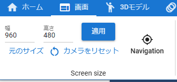
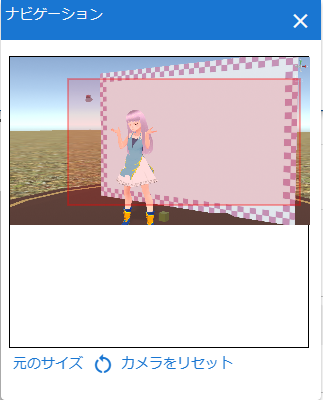
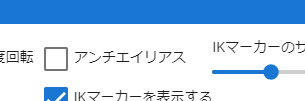
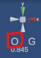

##########################
App operation
##########################

.. contents::

.. index::
    Change screen resolution

(Web application version) Use in a separate window from the browser
=========================================================================

The web app version can be used in a completely separate window from the browser itself, such as Chrome or Edge, using a technology called PWA.

See :doc:`../man1/install` for details.

merit
    * You can make the window size different from the browser body
    * You can continue using this application even if you close the browser body
    * Appearance becomes closer to the app of each OS
    * Added to the Start Menu or Launcher Menu and can be opened from there

Please install the web app version instead of using it as a tab.

Change screen resolution
============================

By default, the WebGL screen that manipulates the 3D model has a size suitable for the window size. With this application, you can freely change the size (≈ resolution) of the WebGL screen.

|

1. Enter the ``Width`` and ``Height``.
2. Press the Apply button.

Scrollbars are displayed if they do not fit in the display area.

**restore to original size**

1. Press the ``Original Size`` button.

.. index:: navigation (common usage)

Take advantage of navigation
-------------------------------

When the screen resolution increases, it is necessary to scroll the part that cannot be seen before operating. In that case, using the ``navigation`` implemented from Ver 2.0 makes it easier to operate.

1. Press the ``Navigation`` button in the Screens tab of the ribbon bar.

.. image:: ./img/general_scr02.png
    :align: center

|

2. A small navigation window will appear inside the main app window.

|

3. A red frame is displayed as the currently displayed range on the navigation preview screen.
4. If the resolution of the WebGL screen is larger than the display area, clicking or dragging the red frame anywhere will scroll the WebGL screen accordingly.

.. hint::
    You can also ``Resize'' and ``Reset Camera`` from within the navigation window.

|

.. index:: apply anti-aliasing

apply anti-aliasing
================================

With this application, you can apply anti-aliasing to the WebGL screen.

1. Open the Screens tab of the Ribbon bar.
2. Check ``Antialiasing`` on the right.

|

.. warning::
    * It is possible to play poses and motions while it is on, but the operation may become slow.
    * Anti-aliasing is originally in the category of system effects (post-processing), but in consideration of the impact on operation, it will not be registered in animations.
    * When anti-aliasing is enabled, unnecessary lines may intersect when capturing ``sky night blue/sky night purple`` in the sky setting of the Stage object. This is the WebGL specification. please note that.

|

.. index:: change the display of IK markers

Change the size and display of IK markers
================================================

To change the size of the IK marker, specify it from Options on the ``Screen`` tab of the ribbon bar.

.. image:: ../img/screen_ribbon_scr_02.png
    :align: center

|

resize
    Specify by moving the IK marker size slider.

the display itself
    Turn on/off the check for Show IK Markers.

.. index::
    Operating the main camera
    Main camera reset
    Main camera Z-axis reset

Operating the main camera
===================================

In this app, the main camera always has a center point that serves as the axis of rotation. The display can be turned on and off by setting, but the display is turned on by default for clarity.

Since keyboard operations are involved, please see :doc:`../man5/special_operation` for detailed operation methods.

.. image::img/spcl_01.png
    :align: center
    :alt: center point

|

"■" displayed in dim semitransparency is applicable.

The main camera rotates based on this center point. If you bring the object you want to see closer to the center point, you can see the object in 360 degrees.

However, if you continue to move the camera or move the object, the distance and position may not necessarily match, and the display may gradually shift. In that case, press the ``I key`` or ``O key`` on your keyboard.

Then the center point will move closer or further away from the main camera.

**Distance between center point and object**

The distance between the center point and the currently selected object is displayed in the upper right.

.. |sub2| image:: ../img/screen_vpad_2.png
.. |sub3| image:: ../img/screen_vpad_3.png

.. image::img/spcl_02.png
    :align: center
    :alt: Distance between center point and object

|

This is just a guideline. If you press the I and O keys, there will be a **border between decreasing and increasing values**. That is the point where the center point and the currently selected object overlap. If you rotate the camera there, you can rotate around the object relatively cleanly.

.. hint::
    The same operation can be performed with the buttons |sub2| |sub3| on the v-pad. :doc:`../man1/screen_vpad`

**If you move or rotate too much and the center point is blown away**

If you move, rotate, or change the axis on the upper right of the WebGL screen, the center point may shift. In that case, press the ``R key`` when the keyboard is in camera mode. Then the main camera and center point will be reset to the initial position.

.. hint::
    The same is true for the ``Reset Camera`` button on the Screen tab of the ribbon bar.

    Press the ``Q`` key to reset the hard-to-adjust Z axis.

|

.. index::
    Objects and keyboard operations
    Global and local coordinates

Objects and keyboard operations
========================================

For a detailed explanation of keyboard operations, please see :doc:`../man5/special_operation`.

Standard of operation
    This app is based on **global coordinates**.

    .. note::
        You can operate by switching global ←→ local coordinates by keyboard operation.

        .. csv-table::

            ``X key`` , global/local switching for IK markers
            ``G key`` , global/local switching for keyboard movement/rotation
    
        However, what is displayed in the input field on the UI is the global coordinates.

.. |objmark_GL| image:: ./img/spcl_03.png

the state of the current operation
    The operating criteria for the current object or screen are displayed in the upper right.

    .. csv-table::
        :header-rows: 1
        :stub-columns: 1
        :align: center

        , operation mode, coordinate switching
        Value 1, C - Camera, G - Global
        value 2, O - Object, L - Local
        Screen display, |objmark_CO| , |objmark_GL|
        Operation key, M key, G key

    left alphabet
        Indicates the operation mode with the keyboard. Pressing the ``M key`` will switch C - O.

        **C** operates the main camera, and **O** operates the selected object.

    right alphabet
        Indicates the coordinates at which the object is manipulated. Pressing the ``G key`` will switch G - L.

        **G** moves and rotates in global coordinates, and **L** moves and rotates in local coordinates.

        .. warning::
            Global/local switching of the ``X key`` is not reflected. Please be careful of confusion.

.. hint::
    Setting the manipulation mode to ``O`` object will allow you to move and rotate the object with both mouse and keyboard, which will be more efficient.

Get more out of your mouse and touch interactions
===========================================================

This application moves the WebGL screen with a mouse or touch operation, but depending on the usage and environment, it may be necessary to use keyboard operations such as the Ctrl key and SPACE key. A window called v-pad allows all mouse operations in an environment where the keyboard cannot be used immediately.

By using this window, you will be able to use the movement, rotation, zoom in and zoom out of the main camera in common without worrying about the mouse or touch environment.

.. image::img/spcl_05.png
    :align: center

|

See :doc:`../man1/screen_vpad` for how windows look and how to use them.

Various operation examples
    * Main camera, rotate with mouse + move main camera with WASD FV
    * General operation of main camera with v-pad, fine adjustment with mouse

Try to find the operation method that suits you.

|