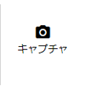
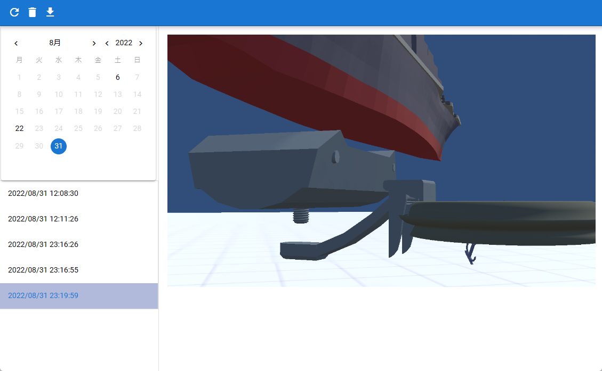

##########################################
Screenshot
##########################################

.. contents::

.. index:: take a screenshot (shoot)

picture
=========================================

You can take a screenshot of the current WebGL screen state and save it.

1. Open the Home or Display tab of the Ribbon bar.

2. Click “Capture” on each tab.

.. |screencap| image:: img/photograph_2.png

============= ============
Home tab      Screen tab
------------- ------------
|homecap|     |screencap|
============= ============

3. To view the screenshots you have taken, click "List".

* Screenshots will be displayed in a separate window.

.. note::
    * Only the "capture" button, which is thought to be used frequently, is placed on the home tab.
    * You can shoot with the sky and ground transparent by checking "**Make transparent**" in the background options.
    * IK markers are automatically cut without changing settings.

|

.. index:: View screenshot (taken)

look
=========================================

The screenshots you take are saved in the app. All can be viewed in a separate window and saved as needed.

1. Click “List” on the screen tab of the ribbon bar to open it.

|

:What you can do:
    * display in chronological order
    * Update to the latest state (because shooting on the main screen is not immediately reflected in another window)
    * delete
    * save to local disk

|

.. hint::
    If there is more than one Camera object, previewing with one of them will make that image the target of the screenshot. When you stop previewing everything, it will return to the image from the main camera.

    Since the preview in the viewport and render texture is also reflected, please turn on "Take screenshots with HTML function" in the settings as necessary. Then, the screen shot will be taken as it is (including the camera object viewport and render texture) on the WebGL screen.

|

.. index:: search for screenshots

seek
============================

The screenshots taken are managed in date order, and it is possible to search for specific dates from the calendar.

.. image:: img/photograph_e.png
    :align: center

|

Dates with screenshots are darkened and clickable.

1. Click the darkened date.
2. The displayed contents of the screenshot list are updated, and the screenshots for the selected date are displayed.

.. index:: save screenshot

save
======================================

.. |dwnbtn| image:: img/vtt_013.png

1. Select the screenshot you want to save.
2. Press this button |dwnbtn| on the toolbar.

.. note::
    * When using from a browser, you can also copy the image to the clipboard and use other functions by right-clicking.