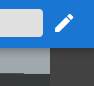
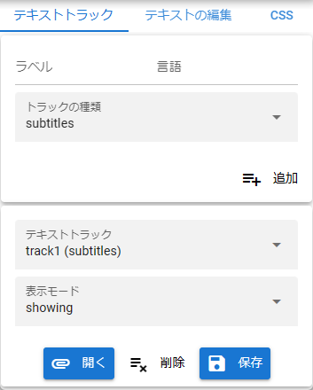
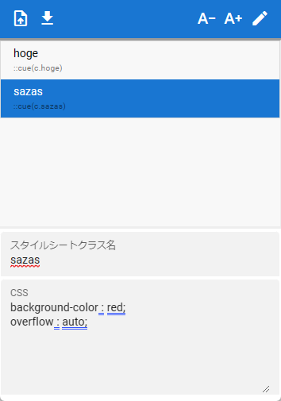

######################################
Edit Subtitles
######################################

.. index:: edit subtitles

A subtitle editing function has been implemented in the video player since ver 1.2.0.
After recording, you can start editing the subtitles to match the video without using any other apps or tools.

For subtitles and text tracks, please see the following page on MDN.

https://developer.mozilla.org/en/docs/Web/API/WebVTT_API

.. contents::

show the panel
=========================

To edit subtitles, press the Edit Subtitles button in the top right.

.. csv-table::
    :align: center

    |headerbtn|, ->, |rightpanel|

|

Add a text track
====================================

The video player has one text track by default. This is the method if you want to add more.

.. image::img/vtt_004.png
    :align: center

|

1. Open the Text Track tab.
2. Enter a ``label`` for the top of the panel.
3. Enter the ``Language`` next to it. (For Japanese, ``ja-JP`` etc.)
4. Select the track type.

.. hint::
    See below for track types.

    https://developer.mozilla.org/ja/docs/Web/HTML/Element/track#attr-kind

    ``subtitles`` is fine for normal use.

|

Manage existing text tracks
======================================

Manage existing text tracks by selecting or deleting them.

.. image:: img/vtt_005.png
    :align: center

|

1. Select the track you want to operate from the ``Text Tracks``.

Change display mode
--------------------------

1. Select the desired mode from the ``Display Mode``.

.. csv-table::
    :header-rows: 1
    :align: center

    mode name, effect
    disabled, disable the track completely.
    hidden, hides the track.
    showing, showing the track.

.. hint::
    For a detailed explanation of the mode, please see the following site.

    https://developer.mozilla.org/ja/docs/Web/API/TextTrack/mode

|

load subtitle file
---------------------------

Load the subtitle file on your device.

1. Click the Open button.
2. Select the desired subtitle file and open it.
3. The content of the subtitle file will be read into the selected track.

:Corresponding file extension: .vtt, .srt

.. note::
    Functions that cannot be prepared in this application can also be described in VTT and SRT files (style sheets, comments, etc.). The effect of those settings can be demonstrated even when playing on this application, but it is not reflected on the UI of the application.

    Especially if you want to add or edit a stylesheet, redefine it in the CSS tab.

|

Save as subtitle file
---------------------------------------

Save the selected text track as a subtitle file on your device.

1. Press the Save button.
2. Give the file a name and save it.

.. warning::
    Please note that if you re-save the subtitle file loaded from the device, the style sheet included in the original subtitle file will not be saved.

edit subtitles
==============================

.. noteYou can add or remove subtitles in the selected text track.

The upper toolbar has a display of the current seek position and delete/add/apply buttons.
The operations that can be performed in the subtitle list are as follows.

.. csv-table::

    click select
    Double-click, automatically seek to the start of the selected subtitle

|

.. image:: img/vtt_003.png
    :align: left

|

**What you can edit with subtitles**

You can set the following properties for subtitles:

start position/end position
    .. image::img/vtt_010.png

    After moving with the video seek bar, the left icon determines the start position, and the right icon determines the end position.

:text:
    Subtitle text. Note that you can use the following tags:

..
    .. csv-table::
        :header-rows: 1

        tag, function
        <b></b>, bold
        <i></i>, italic
        <u></u>, underline
        <ruby></ruby>, Ruby
        <c.class name></c>, Apply style by specifying CSS class name. In this application, this is automatically assigned when the ``style sheet class name`` described below is specified, so there is no need to specify it.

:Horizontal (position):
    Sets the X-coordinate position of the subtitle in the video as a percentage.

    :Horizontal (Automatic):
        Automatically adjust the position of the X coordinate.

:Vertical (line):
    Sets the Y-coordinate position of the subtitle in the video as a percentage.

    :Vertical (Automatic):
        Automatically adjust the position of the X coordinate.

|

:justify:
    Adjust the position in the subtitle area.

    It is align of VTTCue.

    https://developer.mozilla.org/en-US/docs/Web/API/VTTCue/align

:Subtitle size:
    Set the subtitle area. **not font size**. If this size is smaller than the character size, the subtitles may not fit.

:stylesheet class name:
    Specify the class name defined in the CSS tab. Subtitle fonts and colors change according to the stylesheet.

.. note::
    It corresponds to a class called VTTCue. For details, please see the page of the following site.

    https://developer.mozilla.org/en/docs/Web/API/VTTCue

add subtitles
---------------------------

.. |cueaddbtn| image:: img/vtt_007.png

1. Move the video seek bar.
2. Press the start position icon.
3. Move the seek bar to the desired end position.
4. Press the icon to the end position.
5. Enter the subtitle properties.
6. Press this button. |cueaddbtn|

Select/edit subtitles
-------------------------------

1. Select the desired line on the list of subtitles.
2. Set the start position, end position, and properties in the same way as when adding .
3. Press this button. |cueeditbtn|

remove subtitles
----------------------------------

1. Select the desired line on the list of subtitles.
2. Press this button. |cuedelbtn|

|

manage CSS
=========================

You can add or remove stylesheets that apply to subtitles.

.. warning::
    Stylesheets included when reading .vtt or .srt files cannot be restored to this tab of this application due to HTML specifications.

    If you want to save it again, please redefine it in this tab.

|

Load CSS file
----------------------

You can load a .css file and use it as a subtitle stylesheet.

.. |upbtn1| image:: img/vtt_012.png

1. Click |upbtn1| at the left end of the CSS tab toolbar.
2. Select the .css file and open it.

.. caution::
    Definitions with ``::cue()`` selectors in .css files are targeted (other selectors are ignored).

|

Save CSS to file
-----------------------

Save the CSS defined on this application as a .css file separately from the .vtt file.

1. Click |dwnbtn1| at the left end of the CSS tab toolbar.

.. note::
    * The file name is fixed at ``style_[date-based serial number].css``.

add CSS
-----------------

1. Fill in the ``stylesheet class name`` field.

* You don't need to write ``::cue()`` here. It's just a name.

2. Write the styles you want in the ``CSS`` input box.

* Write like normal CSS.

..code::css

    font-size: 12pt;
    background-color : rgba(0,0,0,0.5);
    fotn-weight: bold;

3. Press this button |cueaddbtn| on the toolbar.

Edit CSS
--------------------

1. Select the line of the class name you want to edit in the CSS list.
2. Change the style in the ``CSS`` input box.
3. Press this button. |cueeditbtn|

.. warning::
    The stylesheet class name cannot be changed.

Remove CSS
----------------

1. Select the line of the class name you want to delete in the CSS list.
2. Press this button. |cuedelbtn|