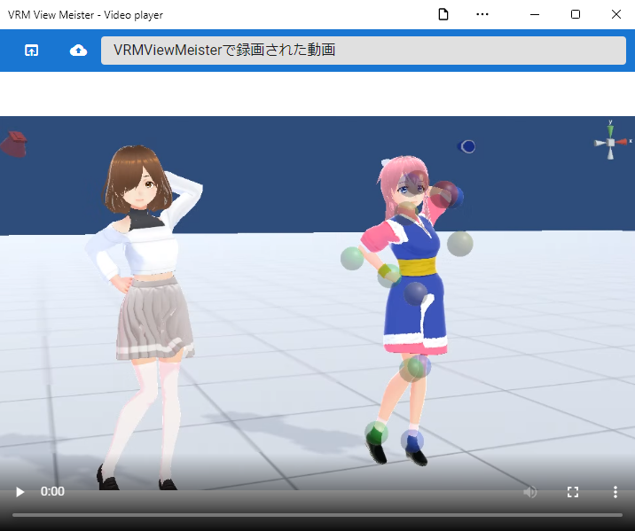

##########################################
Video
##########################################

With this application, you can shoot not only still images by screenshots, but also movies of the WebGL screen.

Of course, it can be used not only for each OS version but also for the web application version.

.. contents::

.. index:: Record (shoot)

record
=======================

.. warning::
    Although the standard functions of the browser are used, the following browsers are recommended for stable operation.

    * Chrome
    * Edge (Chromium version)

    * There are no restrictions for the PC version.

1. Click the record button under ``Record`` in the Screen tab of the ribbon bar.

.. image::img/photograph_4.png
    :align: center

|

2. Play the action or animation you want to include in your video.

|

.. note::
    All actions on the WebGL screen are recorded. (Because settings such as IK marker on/off are recorded as they are, please turn them off in advance.)

3. Click the Stop button.

.. image:: img/photograph_6.png
    :align: center

|

* If you start and stop recording even once, you will be able to press the download button.

.. image:: img/photograph_7.png
    :align: center

.. hint::
    mute video audio

    .. image:: img/photograph_c.png
        :align: center

    When recording with this app, you can also record audio. In the future, we plan to support narration by voice synthesis. In general, it can also be used for the purpose of recording sound effects, etc. However, there may be times when you don't want to add sound unnecessarily because you don't have a microphone or you're not feeling well.

    In such a case, you can switch between activating and muting the audio by pressing this button.

|

.. index:: Watch video (shoot)

look
==================

This application has a built-in video player, so you can immediately check the video recorded by the application.

|

1. Click the "Video player" button on the screen tab of the ribbon bar.

.. image:: img/photograph_9.png
    :align: center

|

.. |appvideo| image:: img/photograph_a.png

|appvideo| Loads videos recorded with the app. The content will be rewritten each time you record, so save it if you want to see it forever.

|localvideo| Loads a video file on the device. Supported formats follow the specifications of the video element of each browser. Only ``.webm`` and ``.mp4`` can be opened as apps.

.. hint::
    You can also use the :doc:`./texttrack` feature described later.